# Vejledning to branching i GitHub desktop

1. Sådan skal din startskærm se ud  

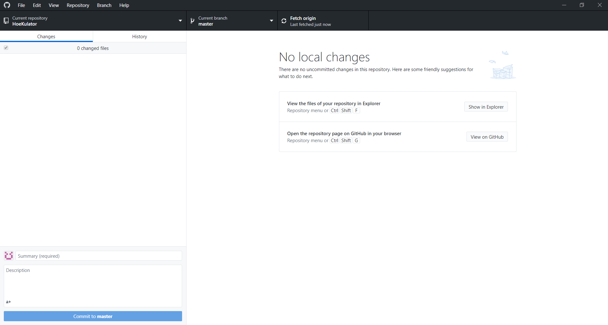

2. Tryk på branch øverst i menuen eller på **current branch**  

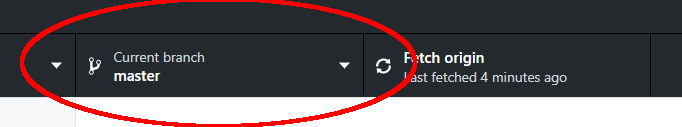

3. Vælg **new branch**  

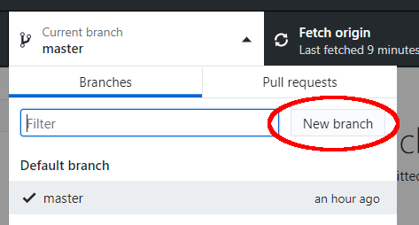

4. Giv et beskrivende navn til din branch og vælg **create branch**  

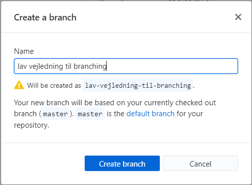

5. Tryk på **publish branch**, så du kan arbejde med den  

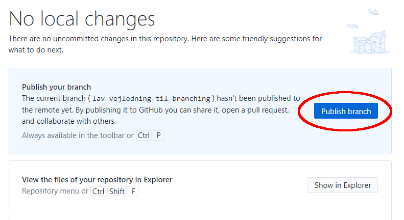

6. Tryk på **show in explorer**  

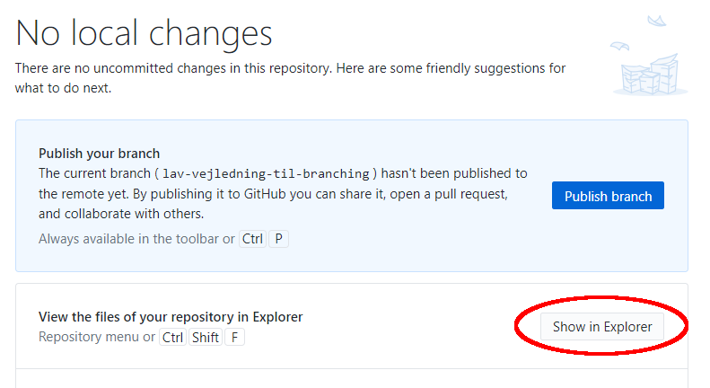

7. Tilføj din fil til repo'et i den rigtige undermappe  

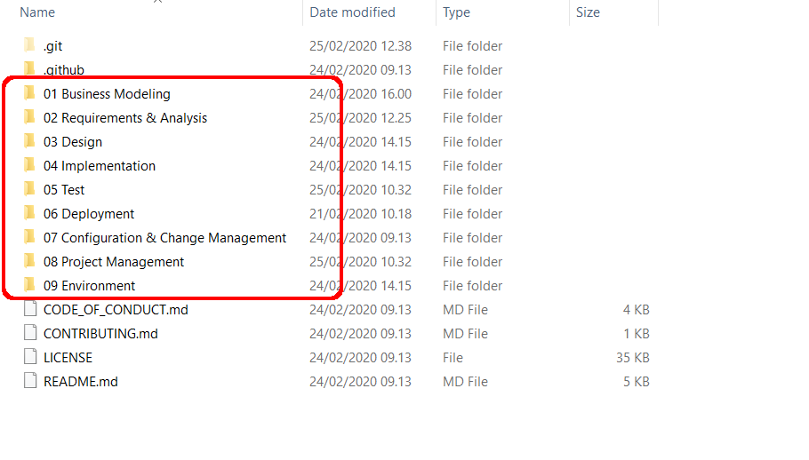

8. Fjern flueben fra alle filer  

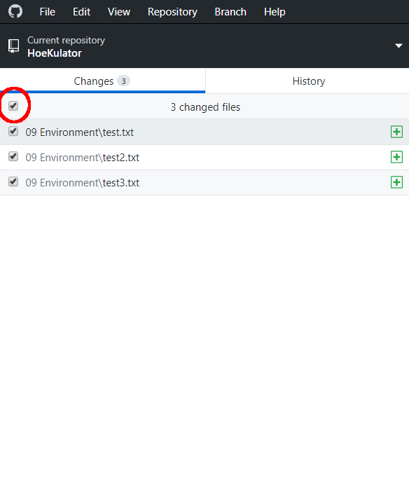

9. Sæt kun flueben i den fil, som du vil committe  

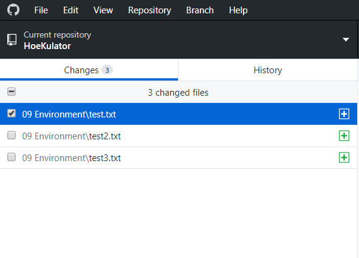

10. Skriv en passende **commit message**. Husk coauthors og reviewers. Hvis dit GitHub navn er forskelligt fra dit rigtige navn, skal du skrive dit eget navn som coauthor.  

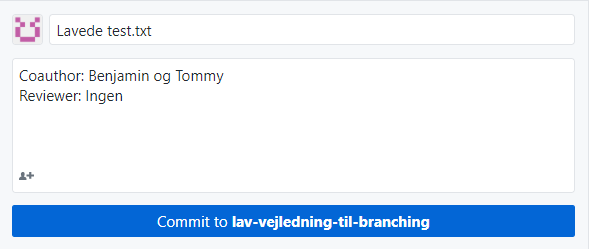

11. Tryk på **commit to branchnavn** 
12. Hvis der er filer, som ikke skal committes, skal du højreklikke på dem og vælge **discard changes** _(OBS filen bliver slettet)_  

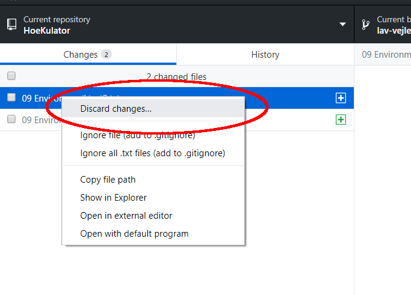

13. **Pull** fra master
14. **Push** dit commit  

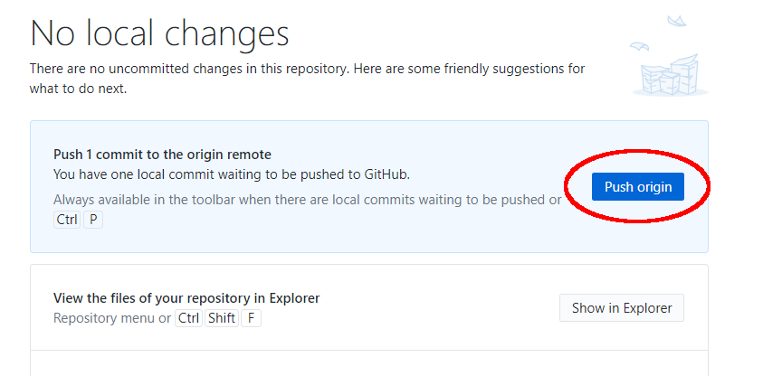

15. Tryk på **create pull request**  

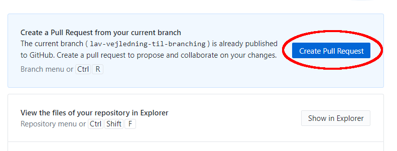

16. GitHub åbnes automatisk i din browser. 
17. Skriv en pull request message. Alle bidragsydere angives som authors. Personen, som gennemfører mergen angives som merger.  
18. Tryk på **create pull request**

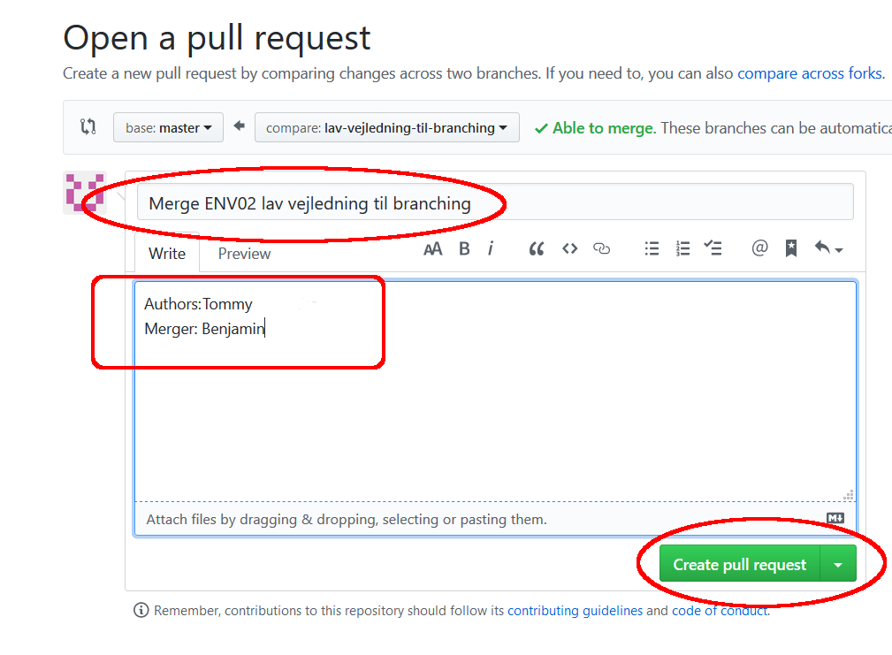

19. Gå til repo'et på GitHub's hjemmeside og tryk på **pull requests** 
20. Tryk på pull requestens navn  

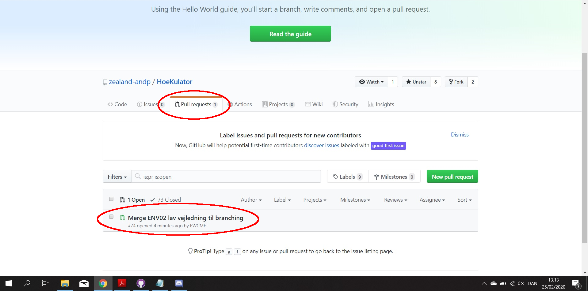

21. Gennemfør pull request
	1. Hvis der ikke er nogen konflikter, **merge** pull request
	2. Hvis der er konflikter, så skal pull requesten slettes og du starter forfra fra punkt 13  
	
	
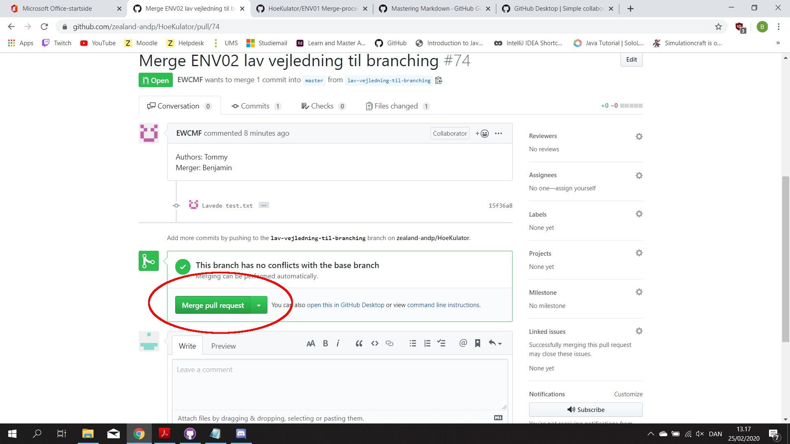	

22. Først når din pull request er gået igennem, skal du huske at slette din branch ved at trykke på **delete branch**