# Vejledning til branching i GitHub webbrowser

1. Naviger til dit repo. Det skal se ud ligesom på billedet.
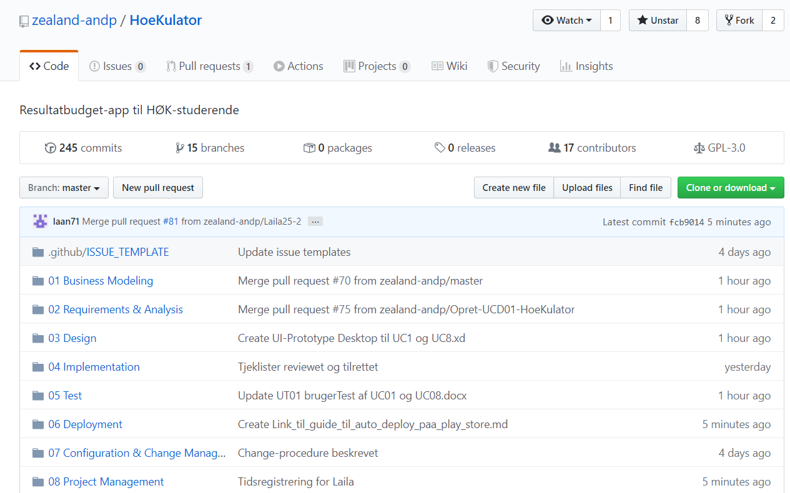

  2. Tryk på **branch: master**.
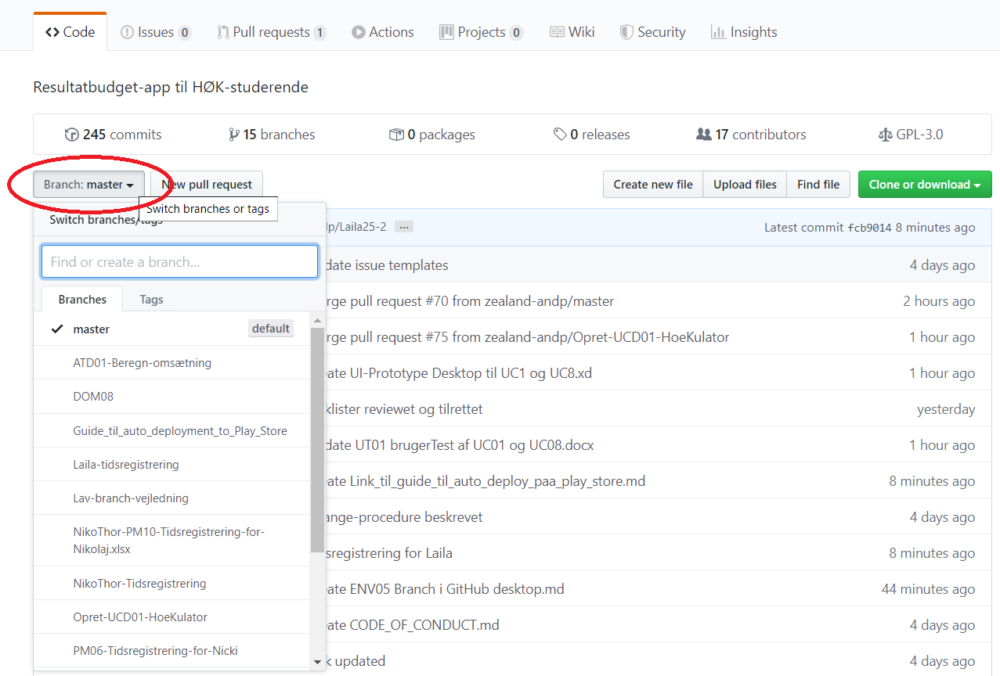

  3. Indtast et beskrivende navn til din nye branch og tryk derefter på **create branch**.
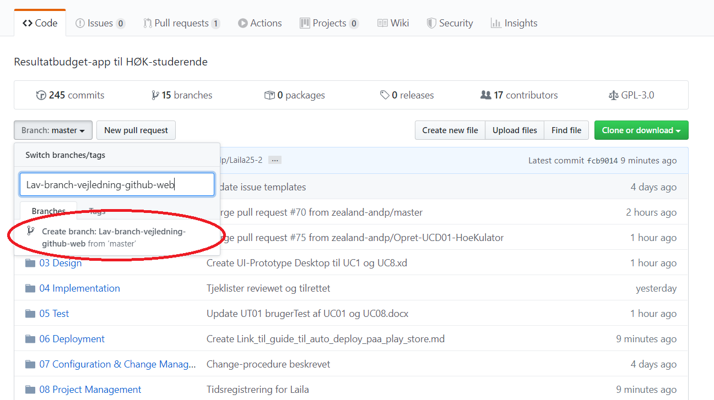

  4. Kontroller at du arbejder i den rigtige branch. Hvis der står **Branch: master** skal du skifte til den branch, du lige har oprettet.
5. Navigér derefter til den ønskede mappe i repo'et.
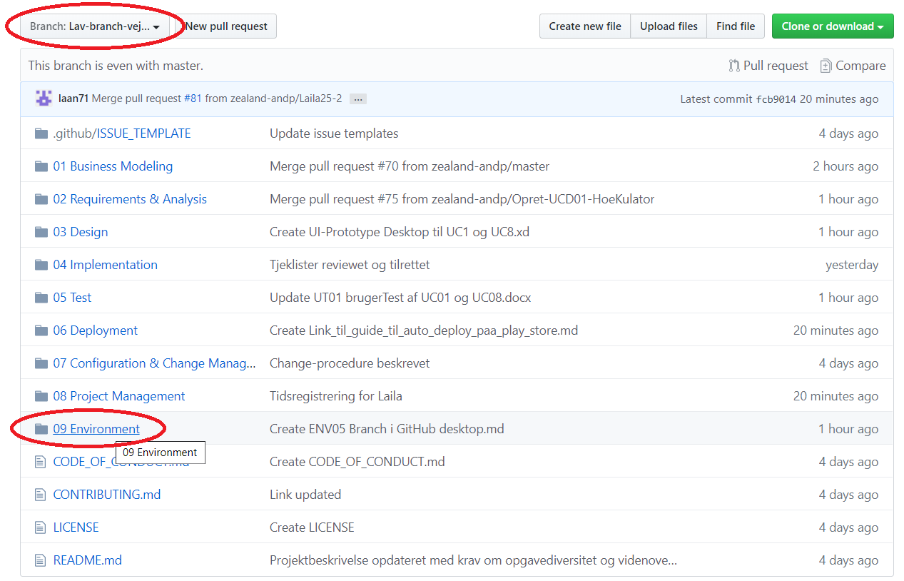

  6. Når du har fundet destinationen til filen, trykker du på **upload files**.
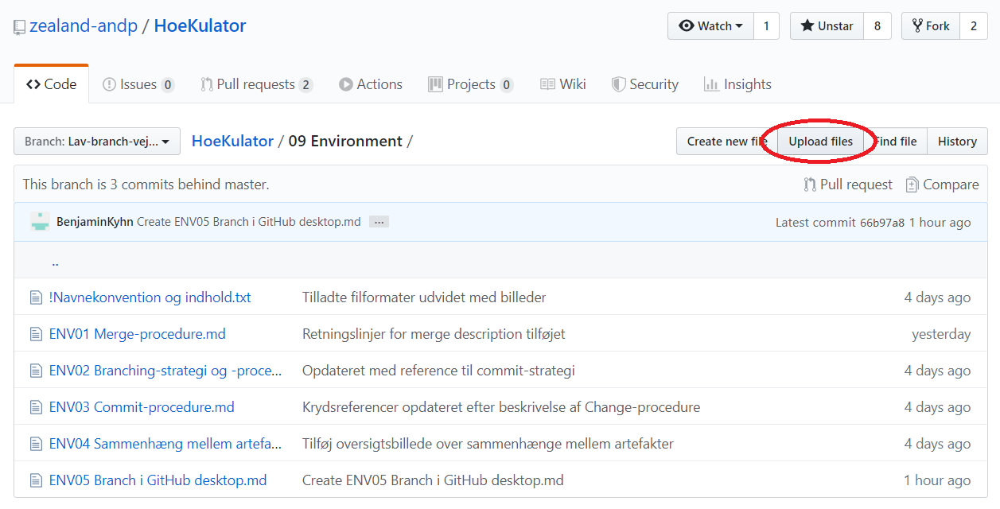

  7. Tryk på **choose your files**
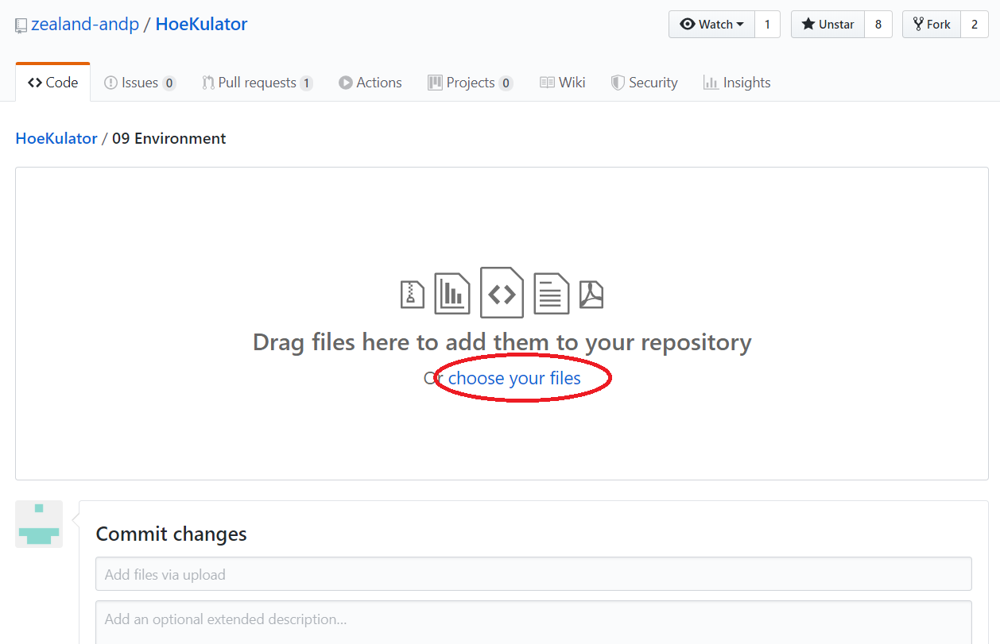

  8. Vælg den ønskede fil
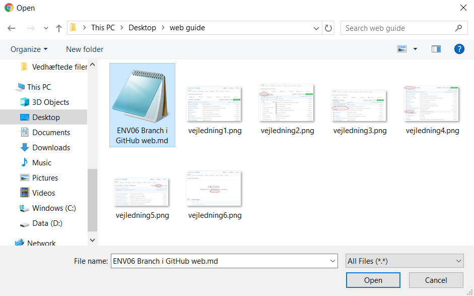

  9. Skriv en passende commit message. Alle bidragsydere skal skrives på som coauthors. Hvis dit GitHub navn er anderledes fra dit rigtige navn, skal du også skrive dig selv på som coauthor.
10. Tryk på **commit changes**
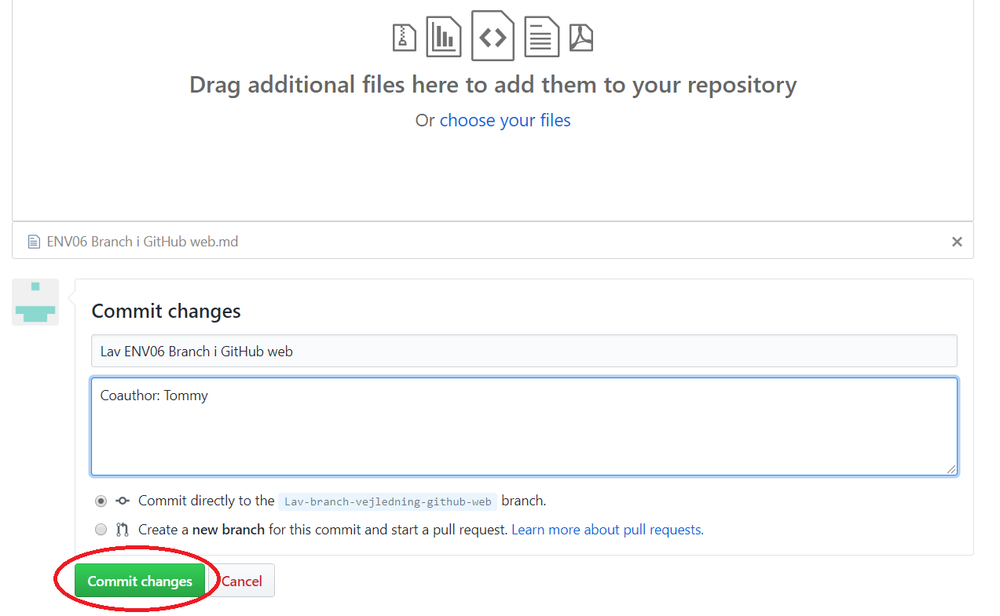

  11. Tilbage på forsiden af dit repo skal du trykke på **Pull requests**
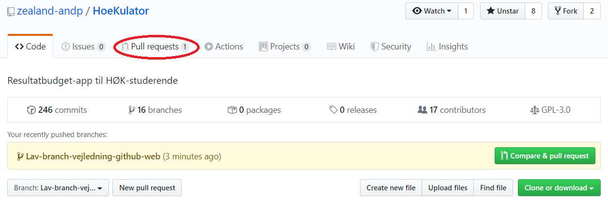

  12. Derefter trykker du på **New pull request**
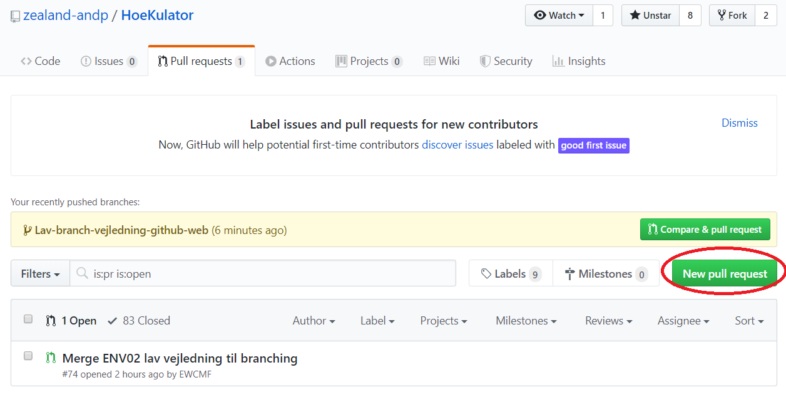

  13. Du skal nu hive masteren over i branchen. Dette gøres for at undgå mergekonflikter. Tryk på **base: master**.

  14. Vælg din branch (base)
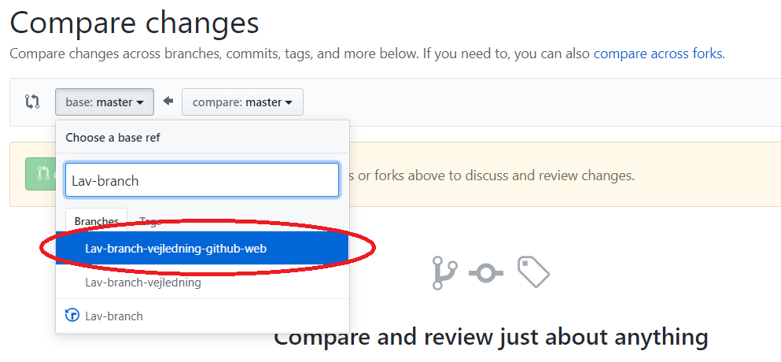

  15. Tryk på **Create pull request**

  16. Merge message skal være "merge master into branch"
17. Tryk på **Create pull request**
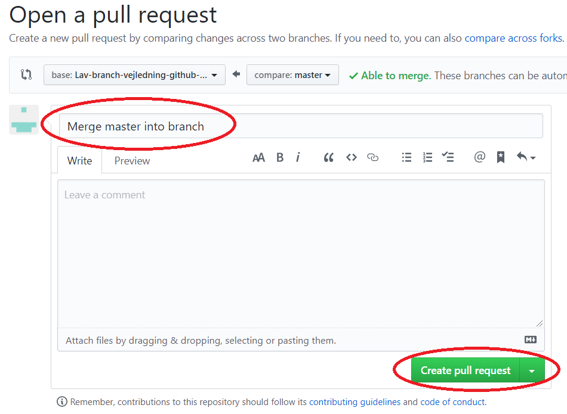

  18. Tryk på **Merge pull request**
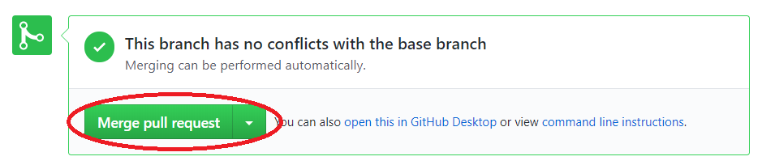

  19. Tryk på **Confirm merge**
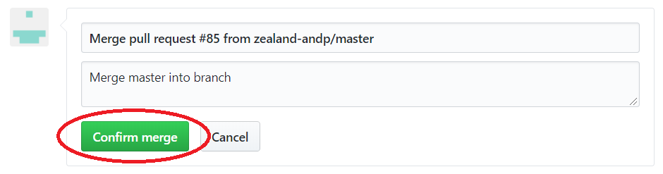

  20. Du har nu pulled masteren ind i din branch og har fået alle evt. ændringer med i din branch. Navigér tilbage til startsiden af dit repo og tryk på **Compare & pull request**
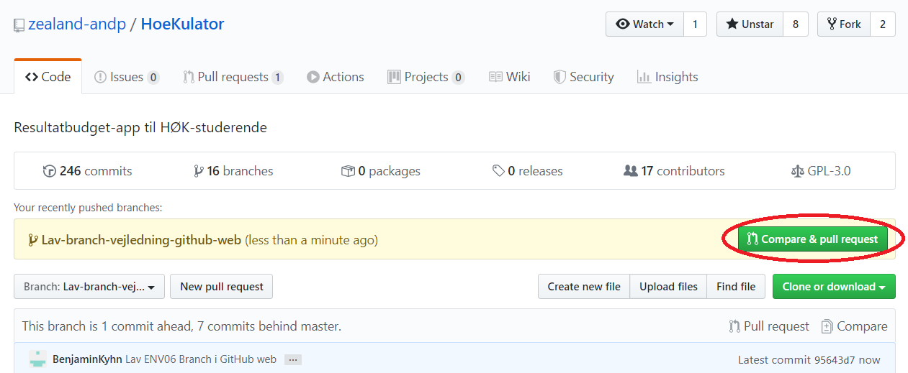

  21. Lav en beskrivelse til dit merge. Ham, der laver mergen, skal angives som merger.
22. Tryk på **Create pull request**
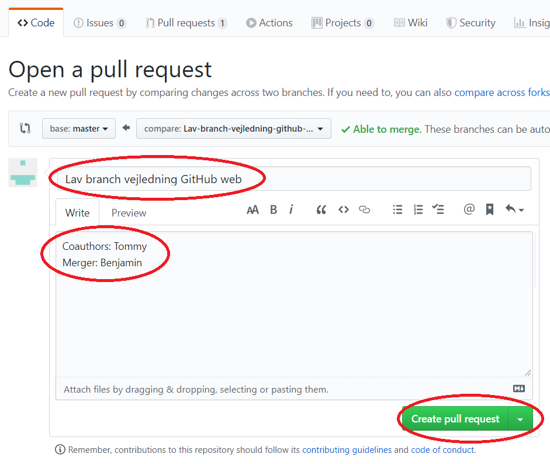

  
23. Du skal nu merge din pull request ind i masteren:
	1. Hvis der ikke er nogen merge conflicts, skal du trykke på **Merge pull request**
	2. Hvis der er merge conflicts, skal du gå tilbage til step 11

  24. Tryk på **Confirm merge**
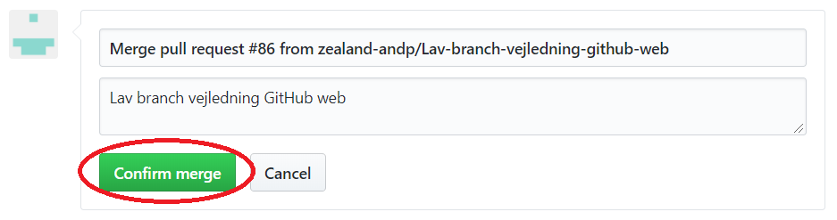

  25. Når branchen er merged ind i masteren, skal du slette branchen.
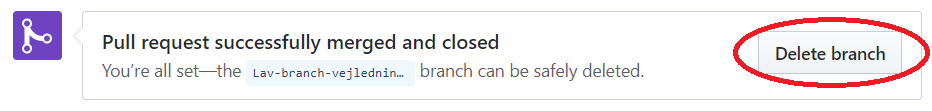
