# Vejledning to branching i Android Studio

1. Åben Android Studio så du er på start siden.  

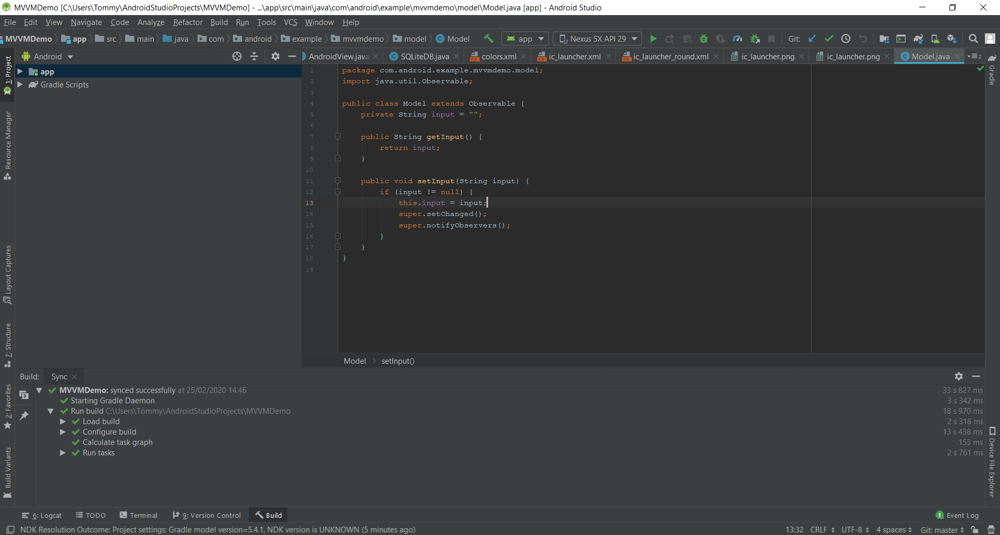

   2. Tryk på file i øvre venstre hjørne og tryk **New > Project from version control > Git**

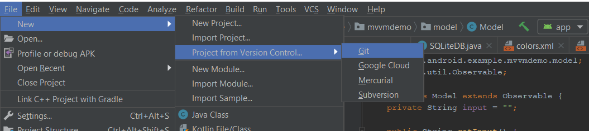

   3. Gå ind på repo'et på Github.com og klon projektet (Kopier linket).  

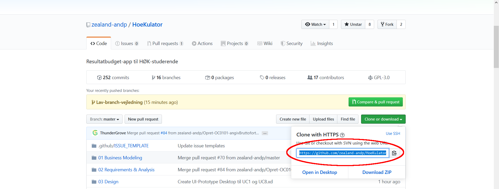

   4. Tilbage i Android Studio sættes linket ind i **URL**
5. Sørg for at **Directory** er et brugbart sted på din PC (Normalt: AndroidStudioProjects\PROJEKTNAVN)  

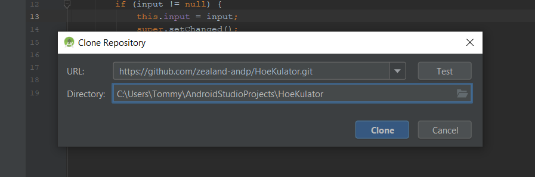

   6. I menuen, tryk på **VCS > Git > Branches**  

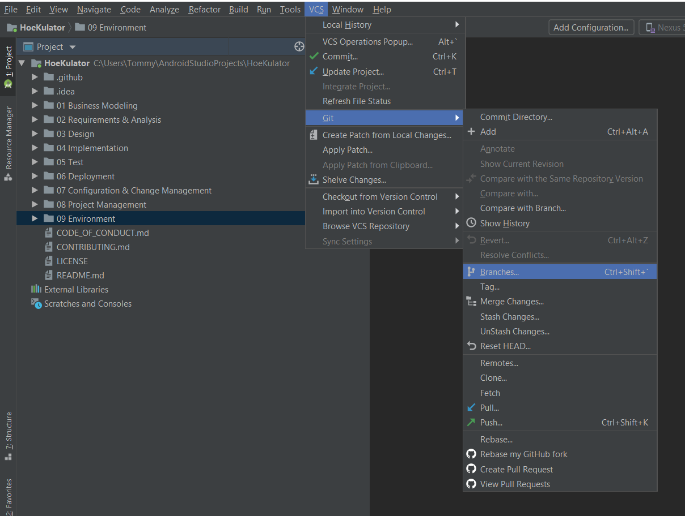

   7. Tryk på **New Branch** i menuen der popper op.  

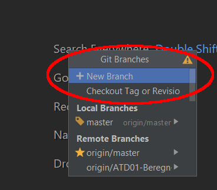

   8. Indtast et beskrivende navn til den nye branch.  

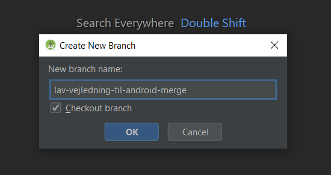

   9. I nedre højre hjørne kan man se den branch man er i.  

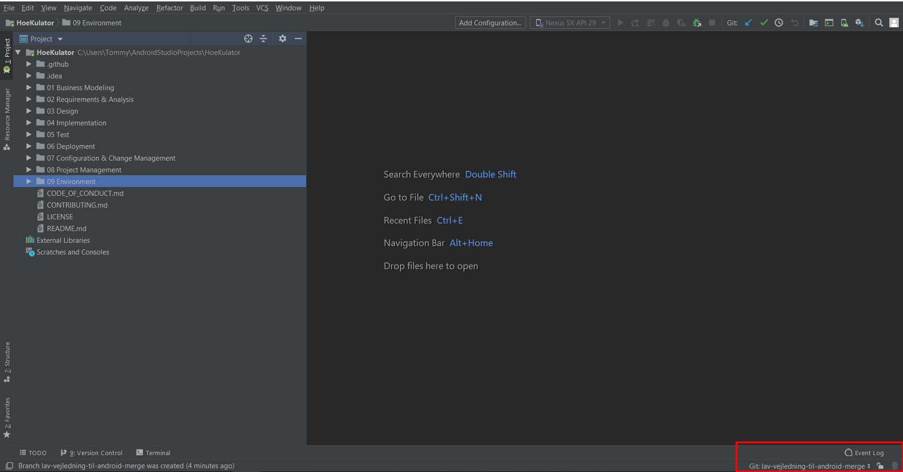

   10. Som kan ses er branch'en stadig kun lokalt på din PC.  

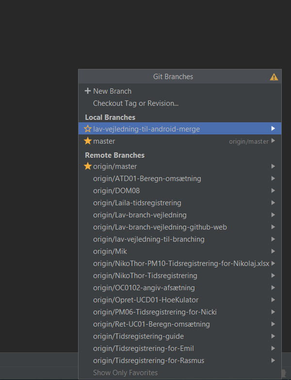

   11. For at branchen kan ses på Github.com skal den pushes først. I menuen, tryk på **VCS > Git > Push**  

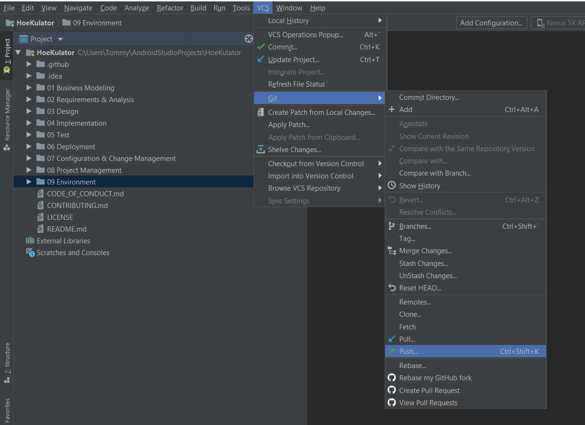

   12. Der skal forhåbenlig kun være en commit.  

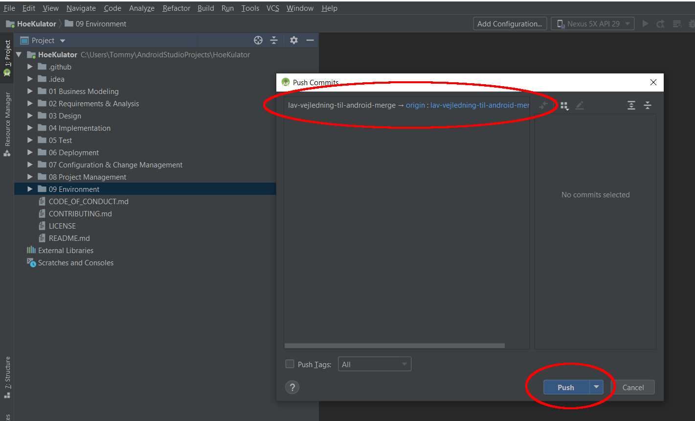

   13. Filer comittes nu i branchen, så der testes med en ny fil i undermappen 09 Environment.  

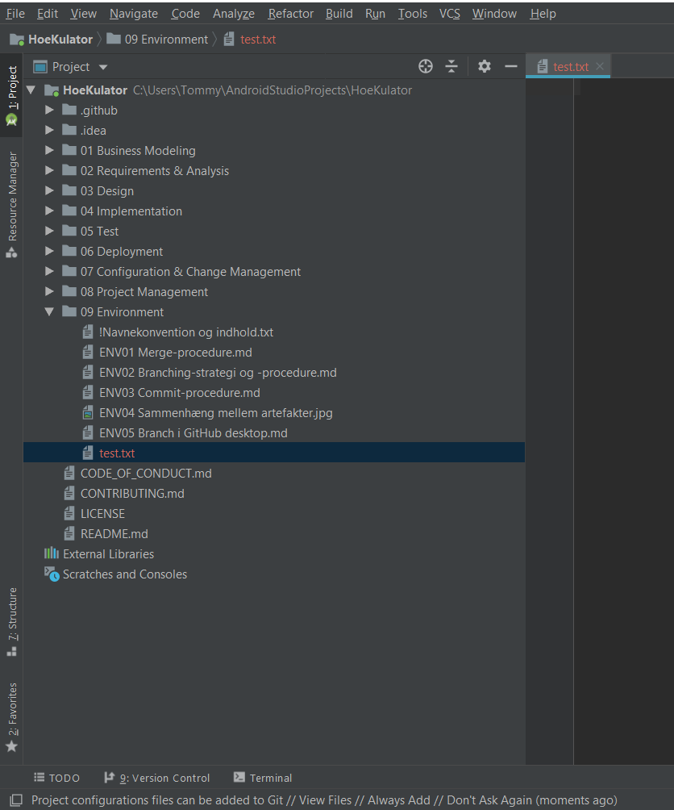

   14. Filen comittes ligesom i IntelliJ ved i menuen at trykke på **VCS > Git > Commit**  

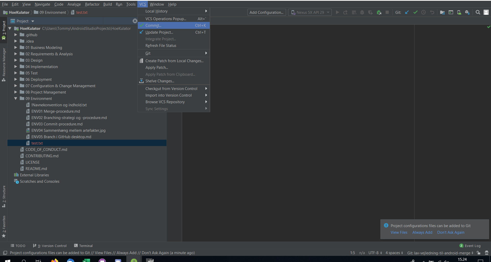

   15. I vinduet der popper op, vælg kun den fil som skal comittes.  
16. Husk en beskrivende **Commit Message**
17. Tryk til sidst på **Commit**

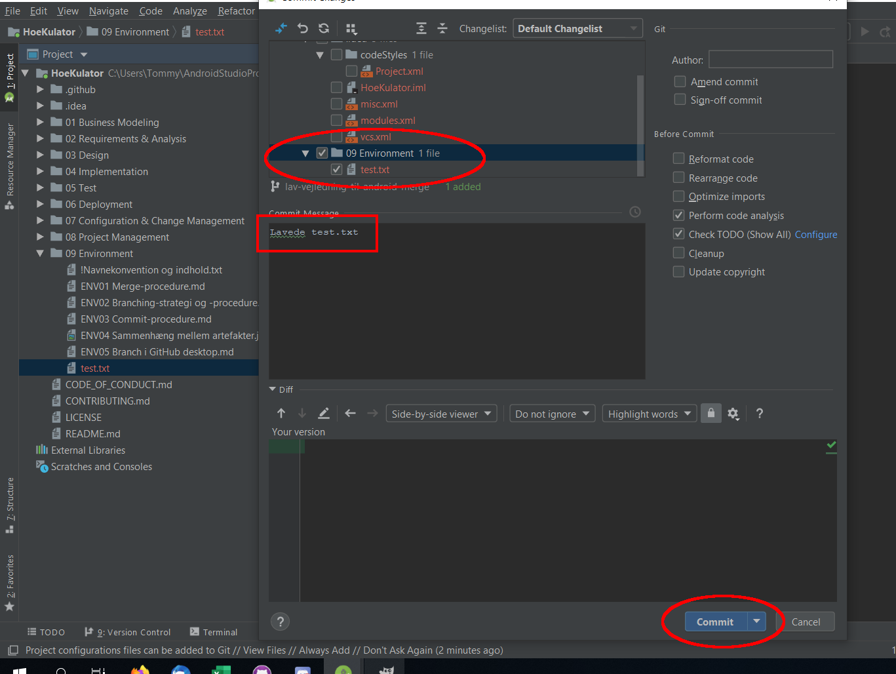

   18. Ligesom i IntelliJ, bliver ens commit først synlig når man pusher så tryk igen på **VCS > Git > Push**  

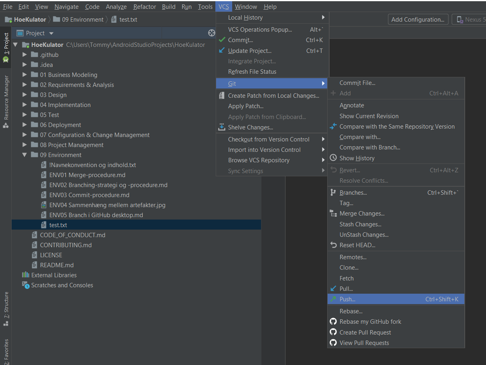

   19. Bekræft at det er de rigtige commits som vises.  

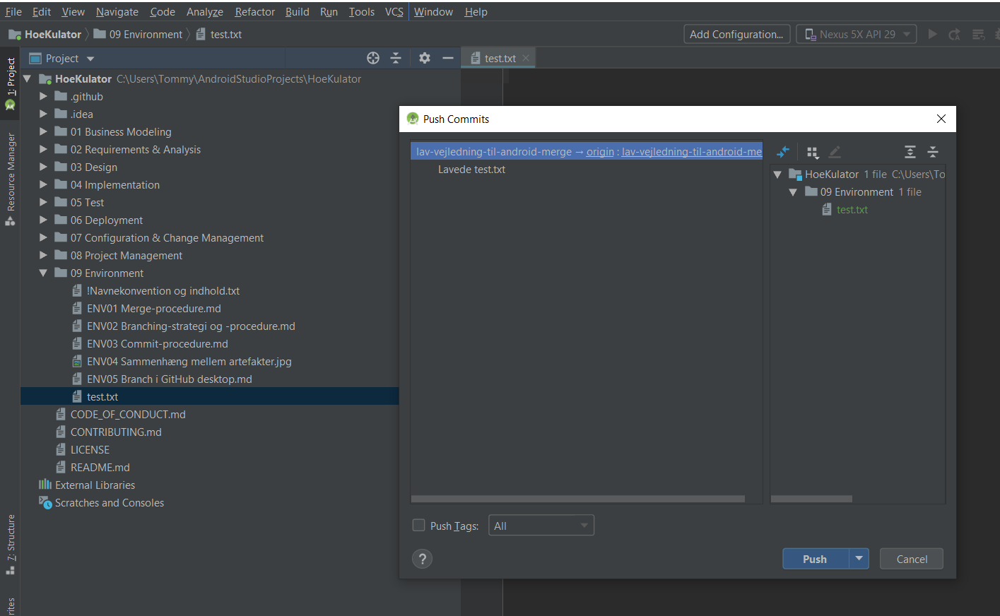 

   20. For at lave pull request, tryk på **VCS > Git > Create Pull Request**  

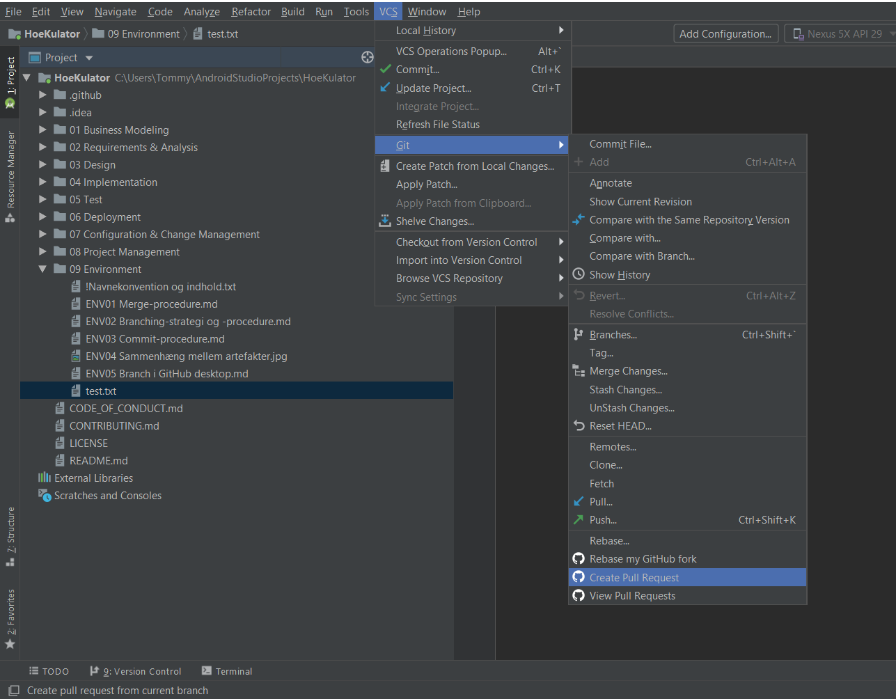 

   21. Indtast en passende titel og beskrivelse til din pull request hvor bidragsydere og merger fremgår.  

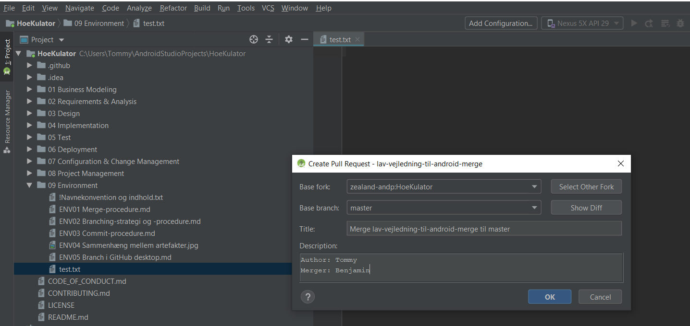

   22. Gå ind på repo'et på Github.com og tryk på **Pull Request**  
23. Vælg den rigtige pull request.

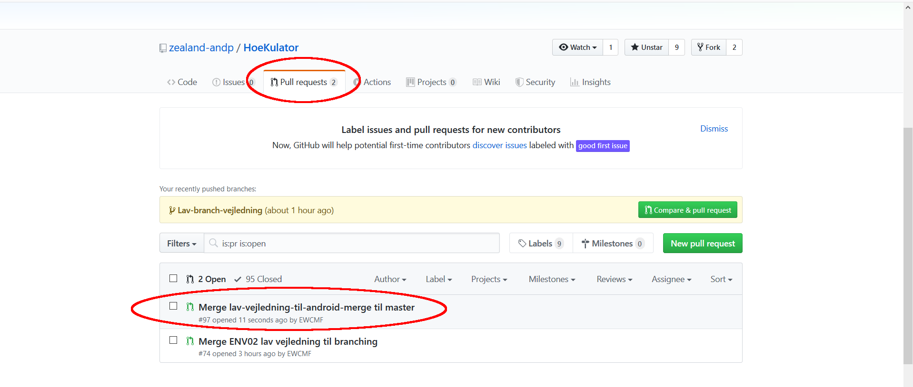  

   24. Hvis der ikke er merge konflikt så kan merger'en trykke på **Merge Pull Request**  

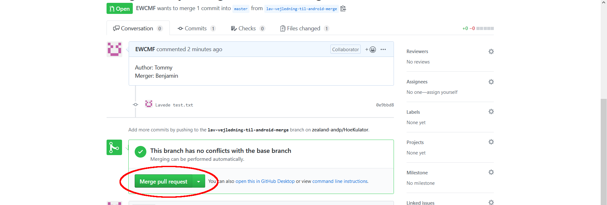 

   25. Når branch'en er merged til master, så skal branch'en slettes.  

 

   